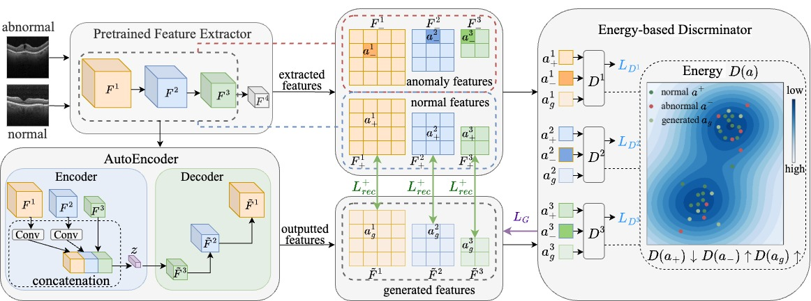

# Boosting Fine-Grained Visual Anomaly Detection with Coarse-Knowledge-Aware Adversarial Learning
PyTorch implementation of Boosting Fine-Grained Visual Anomaly Detection with Coarse-Knowledge-Aware Adversarial Learning


[arxiv](https://arxiv.org/abs/2412.12850)


## Dataset
Please download these four datasets 
[Chest X-rays](https://data.mendeley.com/datasets/rscbjbr9sj/2)
[OCT](https://data.mendeley.com/datasets/rscbjbr9sj/2)
[ISIC2018](https://challenge.isic-archive.com/data/#2018)
[Br35H](https://www.kaggle.com/datasets/ahmedhamada0/brain-tumor-detection)
[MVTec](https://www.mvtec.com/company/research/datasets/mvtec-ad/downloads)
and place them in `./data/` as follows:
```
|-- ChestXRay2017
|   |-- train
|   |   |-- NORMAL
|   |   |-- PNEUMONIA
|   |
|   |-- test
|
|-- OCT2017
|   |-- train
|   |   |-- CNV
|   |   |-- DME
|   |   |-- DRUSEN
|   |   |-- NORMAL
|   |
|   |-- test
|
|-- ISIC2018
|   |-- ISIC2018_Task3_Training_Input
|   |-- ISIC2018_Task3_Training_GroundTruth
|   |-- ISIC2018_Task3_Test_Input
|   |-- ISIC2018_Task3_Test_GroundTruth
|   |-- ISIC2018_Task3_Validation_Input
|   |-- ISIC2018_Task3_Validation_GroundTruth
|
|-- Br35H
|   |-- yes
|   |-- no
|
|-- mvtec
|   |-- carpet
|   |-- grid
|   |-- ...
|
|--visa
|   |--candle
|   |--capsules
|   |--...
|
```

## Installation
Please install the dependency packages using the following command by pip:

```
pip install -r requirements.txt
```

## Taining 
You can run the corresponding script in the dir `./script/` to run the certain dataset after setting the appropriate parameters. For normal data, in Chest X-rays, OCT, Br35H and ISIC2018, the normal category is 0, in MVTec, the normal class can be carpet, grid, and other 13 classes.

To run on the Chest X-rays dataset, you can run the script:
```
bash ./script/xray.sh
```
